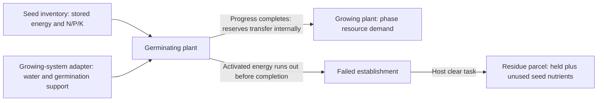

# LOAM — Plant System

**Authoritative specification · system version 1.2 · 8 September 2026**

Implement this specification with the shared
[Growing-System–Plant Contract](GROWING-SYSTEM-PLANT.md). Soil is one resource
provider through its [adapter](SOIL-PLANT.md); no plant behavior depends on it.

## Purpose and scope

A plant requests resources according to its species and stage, accumulates
supported growth, retains acquired nutrients, and produces a harvest plus
residue. Species are data, not branches in the renderer or growing-system module.

Version 1.2 includes a reserve-funded germination period followed by a
fixed-duration crop cycle with one terminal harvest. It models failure from
exhausted establishment energy, but not established-plant mortality, thermal time, maintenance demand, repeated
fruit picking, root competition, fixation or root-carbon feedback. A bean
does not add nitrogen simply because it is a legume.

## State

| Field | Type / unit | Invariant |
|---|---|---|
| `id` | Host-issued stable identifier | Unique in the host world |
| `speciesId` | Species registry key | Resolves in the pinned parameter set |
| `ageDays` | Integer post-germination days | 0 through `maturityDays`; stays zero during germination |
| `growthPoints` | Supported-growth days | 0 through `ageDays` |
| `held` | `{n,p,k}` nutrient game units | Each finite and nonnegative |
| `status` | `germinating`, `growing`, `ready` or `failed` | Only growing plants accumulate yield progress |
| `seedEnergy` | Abstract energy units | Finite, nonnegative; separate from nutrient units |
| `seedNutrients` | `{n,p,k}` | Initial seed nutrient endowment retained until emergence |
| `germinationDays` | Integer elapsed days after sowing | Increments while germinating, including dormant days |
| `germinationProgress` | Supported establishment days | Zero through `germination.requiredProgress` |
| `activated` | Boolean | Becomes true upon first external water uptake; remains true |
| `failureReason` | null or `seedEnergyExhausted` | Set only on failure |

The host binds zero or one plant to each planting slot. A slot may be a soil
cell or another system's growing position. Plants contain no slot geometry,
system type or system state. They never edit providers, charge inventory,
advance global time or write saves.

## Species definition

| Required field | Meaning |
|---|---|
| `id`, `name` | Stable key and display name |
| `maturityDays` | Positive integer post-germination cycle length, at least three days |
| `potentialYieldKg` | Positive configured fresh harvest kg per plant |
| `phases` | Exactly three ordered records: establishment, leafy growth, harvest formation |
| `harvestExportFraction` | Separate N/P/K fractions in [0,1] |
| `germination` | `initialEnergy`, `initialNutrients:{n,p,k}`, `dailyEnergyCost`, `dailyWaterL`, `requiredProgress` |

Energy, energy cost, daily water and required progress are positive finite
values; initial nutrients are finite and nonnegative. Ideal germination must
be possible: `initialEnergy / dailyEnergyCost >= requiredProgress`. Energy
units are a game budget, not joules, carbohydrate mass or N/P/K. Seed nutrient
units use the same N/P/K ledger as plant holdings and growing systems.

Total sowing-to-harvest time includes germination plus `maturityDays`. Parameter
sets must identify this timing basis; do not reuse a seed-to-harvest duration
as a post-germination duration without recalibration.

Each phase contains `id`, exclusive integer `endDay` and
`dailyDemand:{waterL,n,p,k}`. Demands are finite and nonnegative. End days
increase strictly and the last equals maturity. Select the first phase with
`ageDays < endDay`. Phase timing depends on age, not on supported growth.

Display colors and artwork mappings live in a separate presentation registry.
Adding a species requires valid data and an art mapping, not provider changes.
Use the same species definition across compatible providers. Do not create
separate soil/hydroponic/aeroponic copies to encode resource delivery.
Species budgets have provenance and parameter-set versions. Numerical example
budgets in working notes are not authoritative crop settings.

## Public operations

All operations validate inputs, return new records and leave arguments intact.

| Operation | Inputs | Output |
|---|---|---|
| `createPlant` | Host ID, validated species definition | Age/growth/held zero; configured seed reserves; unactivated `germinating`; progress/day zero; failureReason null |
| `requestResources` | Plant and its species definition | Water only during germination; phase demand while growing; zero if ready/failed |
| `advanceGermination` | Plant, species, actual water taken, `germinationSupport` | `{plant, energyUsed, progressAdded, seedTransfer}` using the rule below |
| `advancePlant` | Plant, species, actual `taken`, `growthFraction` | New plant with one day's growth and holdings |
| `estimateYield` | Plant, species | Explicitly labeled estimate described below |
| `finishHarvest` | Ready plant, species | `{freshKg, exported, residueNutrients}` |
| `clearFailedPlant` | Failed plant | Zero fresh kg/export; residue equals `held + seedNutrients` |

## Seed reserves and germination



Sowing imports the configured seed nutrient endowment. It is not borrowed
from the growing system. Energy and nutrients remain different accounts:
spending seed energy never subtracts N/P/K or produces fertilizer.

During germination, request `{waterL: dailyWaterL, n:0, p:0, k:0}`. The
coordinator takes `min(requestedWater, offeredWater)`; this hydration is not
scaled by root support or future yield. The adapter supplies a separate
`germinationSupport` fraction for establishment conditions.

`advanceGermination` validates germinating status, water taken in [0,dailyWaterL]
and support in [0,1], then applies:

1. Increment `germinationDays`. Set activated if actual water taken > 0.
2. If still unactivated, spend no energy and add no progress. A dry unactivated
   seed does not fail merely because days pass; seed aging is outside this model.
3. Once activated, `energyUsed=min(seedEnergy,dailyEnergyCost)` each day,
   even when external conditions subsequently prevent progress.
4. `progressAdded=min(waterTaken/dailyWaterL, germinationSupport,
   energyUsed/dailyEnergyCost, requiredProgress-germinationProgress)`.
5. Deduct energyUsed and add progressAdded. If progress reaches the target,
   transfer all seedNutrients to held, zero seedNutrients and set growing.
   Age/growth remain zero; the first growing day is tomorrow. Remaining energy
   is recorded as unused establishment energy, with no later yield bonus.
6. Otherwise, if seedEnergy is zero, set failed with seedEnergyExhausted.
   Completion takes priority if the final energy also completes germination.

No external nutrient uptake is required before emergence in this abstraction.
Stored N/P/K transfers intact to seedling holdings on emergence; nutrient
remobilization is not modeled day by day. Post-emergence growth represents
photosynthesis through configured potential growth, not continued seed-energy
spending. Growing plants then request external nutrients through their phases.

Failure freezes the plant until a host clear task completes. Clearing returns
all remaining seed and plant nutrient units as one residue parcel and frees
the slot. No automatic disposal, refund, food or reserve regeneration occurs.
The same host destination rules apply as for harvest residues.

`advancePlant` accepts growing or ready plants only and requires `growthFraction` in [0,1] and `taken` equal to the
phase demand times that fraction, within contract tolerance. Reject an
inconsistent call. For a ready plant only a zero-uptake call is valid and
returns unchanged state.

## Growth rule

For a growing plant, once per simulated day:

```text
ageDays += 1
growthPoints += growthFraction
held[element] += taken[element]       // N, P and K separately
status = ageDays === maturityDays ? 'ready' : 'growing'
```

Water taken is recorded as plant-use output from the provider's ledger. It does not
enter `held`. Held nutrients cannot compensate for future deficits in version 1;
they are an accounting ledger, not a remobilization model.

Every post-germination day counts equally. Poor supply reduces supported growth but does not
delay maturity or kill the plant. Zero demand for a resource cannot itself
limit growth. Zero demand for all resources is valid for a test fixture and
must not be used to imply a resource-free biological crop.

## Yield and estimates

At maturity:

```text
freshKg = potentialYieldKg * growthPoints / maturityDays
```

Thus 90% supported growth throughout a crop's life produces 90% of configured
potential yield. This is not a claim that a laboratory “90% soil” score exists.

For a germinating plant, estimates are `{supportedKg:0,projectedKg:null,isFinal:false}`;
for a failed plant both kg fields are zero and isFinal is true. For a growing
plant before maturity, `estimateYield` returns:

- `supportedKg = potentialYieldKg * growthPoints / maturityDays`, a contribution
  toward eventual yield, not edible mass available for harvest;
- `projectedKg = ageDays > 0 ? potentialYieldKg * growthPoints / ageDays : null`,
  assuming the experienced average continues;
- `isFinal=false`. At readiness both quantities equal final yield and
  `isFinal=true`.

Ready plants cease demand and growth. Their yield remains fixed until
harvest; no spoilage is modeled here.

## Harvest and residue

`finishHarvest` accepts only a ready plant. For each nutrient:

```text
exported = held * harvestExportFraction
residueNutrients = held - exported
```

The host commits a crop-specific harvest record, a residue parcel routed to
a host-selected destination, and removal of the plant together. The provider
is not charged again. The plant does not specify a ground cell, reservoir,
compost destination or decomposition rate. Processing belongs to the recipient.
The fresh kg estimate and N/P/K game units are distinct ledgers; neither is
used to infer human nutrition or physical tissue composition.

The host issues residue and harvest IDs derived from the plant ID. A second
harvest command finds no plant and cannot create a duplicate export. A
zero-yield ready plant can still be cleared through this operation.

## Planting and presentation

Planting requires a compatible unoccupied slot and sufficient host seed
inventory. Site examination and equipment readiness are host/provider policies;
the plant does not enforce soil-specific preparation. No composite soil-score
gate exists in Plant. Creating the plant, binding its slot and consuming the
seed are one host transaction. The host accounts for the seed endowment once:
transfer from accounted seed inventory, or record an external nutrient addition
when the inventory only tracks seed counts. Never apply both treatments.

The view adapter exposes germination status/progress, hydration activation,
seed energy remaining, failure reason, species, phase, age progress, supported-growth
fraction and harvest readiness. The journal displays the actual daily report
from the coordinator. It must not reconstruct uptake from animation state.

## Acceptance criteria

1. Successful germination followed by full growing-phase support gives potential yield.
2. Constant 0.9 growing-phase support gives 0.9 yield; germination delay changes
   the calendar, not the post-germination yield denominator.
3. Phase selection is correct immediately before and at every end-day boundary.
4. Holdings grow only by actual external uptake or the one-time seed transfer;
   seedNutrients + held is conserved by that transfer. There is no hidden fixation.
5. Harvest export plus residue equals held nutrients, element by element.
6. A ready plant does not accumulate further growth, age or uptake.
7. Early harvest and inconsistent settlement fail without changing state.
8. Species substitution requires no change to soil or exchange code.
9. Save/load preserves age, growth, holdings and readiness exactly.
10. Identical daily input values from different growing-system adapters produce
    identical plant state and yield, using the same species configuration.
11. Harvest results contain neither a residue destination nor processing rate.
12. A sufficiently supplied seed germinates with zero external N/P/K; only water
    is charged to its provider during establishment.
13. Unactivated dry seeds retain reserves; activated seeds expend energy and can
    fail after stalled establishment. Success on the final energy wins over failure.
14. Seed transfer and failed clearing cannot duplicate or destroy nutrient units.
15. Save/load preserves activation, energy, nutrient reserves and germination progress.
