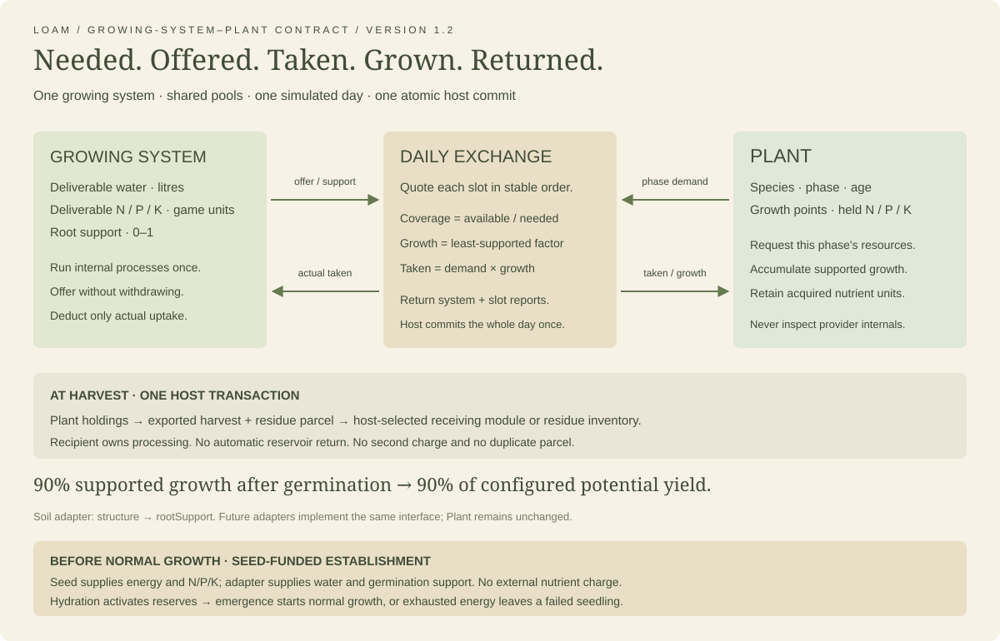
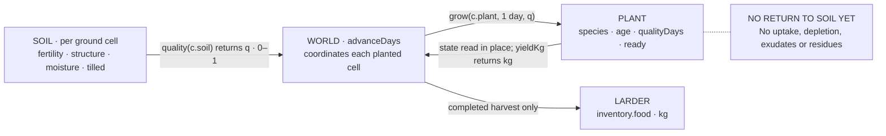
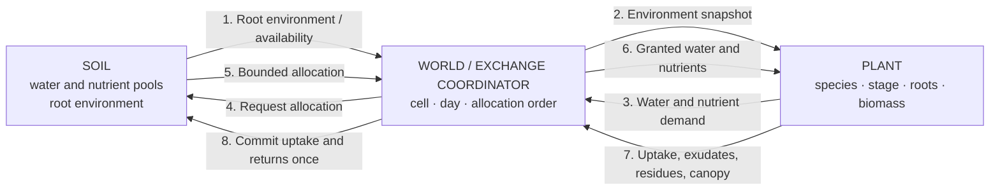

# LOAM — Soil ↔ Plant Interface

> Historical reference only. The authoritative specifications are
> [Soil](SOIL.md), [Contract](SOIL-PLANT.md), and [Plant](PLANT.md).

The implemented soil–plant contract, followed by the intended richer model
and the build order for validating it. Code reviewed: **8 September 2026**.

Status markers as in `GDD.md`: **[decided]**, **[proposed]**, **[open]**.

This document also uses **[implemented]** for behavior verified in current
code. A design marked **[decided]** is not necessarily implemented.

## Read this first

**Today the workshop sends one derived number from soil to plants. There is
no plant-to-soil return channel yet.** `world.js` coordinates the exchange;
the two modules never import each other. The future physical channels below
are design targets, not a description of values currently being exchanged.

| Question | Current workshop | Future design below |
|---|---|---|
| Where is soil stored? | Each ground cell (1 m²) | Keep ground ownership; soil layers remain open |
| What reaches a plant? | `soilQuality`, a dimensionless 0–1 score | Water, nutrient and root-environment observations and allocations |
| When does it happen? | Once per explicit simulated day | Daily exchange with a defined update order |
| What returns to soil? | Nothing | Uptake, exudates, residues and other feedback |
| What determines yield? | Configured potential × lifetime-average quality | Validated growth, allocation and harvest model |
| Is yield validated against field data? | No; workshop parameters | Required by Phase 1 exit criteria |

## 1. Current ownership and source map [implemented]

| Owner / source | Stored state or responsibility |
|---|---|
| [`src/workshop/soil.js`](../src/workshop/soil.js) | Creates soil indices; derives quality; applies water, compost and till actions |
| [`src/workshop/plants.js`](../src/workshop/plants.js) | Species parameters, plant state, quality integration and yield calculation |
| [`src/workshop/world.js`](../src/workshop/world.js) | Owns `cells`, bed membership, inventory, work orders and workshop day; calls both systems |
| [`src/scenes/loam.js`](../src/scenes/loam.js) | Journal display, controls and local save adapter; reads derived values |
| [`tests/workshop.test.mjs`](../tests/workshop.test.mjs) | Tests the 90% rule, changing conditions, completed work, resource accounting and crop loop |

`cells[id].soil` and `cells[id].plant` belong to the ground cell. A bed stores
cell IDs; it does not own or reset soil. Removing a bed boundary leaves both
soil and plants intact. One cell currently holds zero or one plant.

The separate educational [`src/soil/nutrients.js`](../src/soil/nutrients.js)
models nutrient availability for the nutrient scene. Its pH, reserve and
availability calculations are **not connected to workshop plant growth**.
The global `src/engine.js` calendar is also separate from the workshop clock.

## 2. Values currently crossing the boundary [implemented]



The diagram contrasts the implemented scalar interface with the proposed
resource exchange. Editable Mermaid diagrams below show the call sequence.

### Soil state: retained by soil, not sent to plants

All three numeric fields are game indices, **not** laboratory measurements,
water volumes, nutrient masses or percentages of physical soil composition.

| Field | Type / range | Initial formula range | Changed by |
|---|---|---|---|
| `fertility` | number, 0–1 | 0.48–0.66 | Compost: add 0.25, capped at 1 |
| `structure` | number, 0–1 | 0.44–0.69 | Till: add 0.30, capped at 1 |
| `moisture` | number, 0–1 | 0.30–0.48 | Water: set to 1 |
| `tilled` | boolean | `false` | Till: set `true`; also used by artwork |

The initial ranges are mathematical bounds of the coordinate-based formulas;
the finite meadow need not contain their exact endpoints. There is no natural
drying, nutrient depletion, compaction or biological feedback yet.

### Function contract and direction

| Direction | Actual call / value | Meaning and units | Does it mutate state? |
|---|---|---|---|
| World → soil | `quality(c.soil)` | Supplies the soil object for evaluation | No |
| Soil → world | returned number `q` | `clamp(0.4*fertility + 0.35*structure + 0.25*moisture)`; dimensionless 0–1 | No |
| World → plant | `grow(c.plant, 1, q)` | Plant reference, one simulated day, and `soilQuality=q` | Mutates the supplied plant |
| Plant → world | `age`, `qualityDays`, `ready` | Read back from `c.plant`; `grow()` returns no payload | Updated in place |
| World → plant | `yieldKg(c.plant)` | Requests yield estimate from accumulated plant history | No |
| Plant → world | returned kg number | Configured potential yield × average experienced quality | No |
| World → inventory | `inventory.food += yieldKg(c.plant)` | Only when a harvest cell completes | Adds food; clears `c.plant` |
| Plant → soil | **No call / no payload** | No water or nutrients withdrawn; no carbon or residues returned | None |

“Push/pull” here means synchronous function calls. Soil does not broadcast,
and plants do not independently query soil. **The world pulls quality from
soil, then pushes the scalar and elapsed time into the plant calculation.**

### Diagram: the exchange that exists now



### Diagram: one daily update

```mermaid
sequenceDiagram
    participant UI as Workshop controls
    participant W as World
    participant S as Soil
    participant P as Plants
    UI->>W: advanceDays(world, 7)
    Note over W: Refused while walking or working
    loop Each day, each cell containing a plant
        W->>S: quality(c.soil)
        S-->>W: q in [0,1]
        W->>P: grow(c.plant, 1, q)
        Note over P: Mutate age, qualityDays, ready
        Note over S: Soil is unchanged by growth
    end
    Note over W: Increment world.day once per daily pass
    UI->>W: Start harvest work
    Note over W: On completion of each ready cell
    W->>P: yieldKg(c.plant)
    P-->>W: edible yield estimate in kg
    Note over W: Add kg to inventory.food; clear c.plant
```

## 3. Plant state and species parameters [implemented]

| Plant field | Unit / initial value | Role |
|---|---|---|
| `species` | registry key | Chooses the species parameters |
| `age` | days; starts at 0 | Capped at the species' `days` |
| `qualityDays` | quality-score × days; starts at 0 | Accumulated exposure, not biomass or a nutrient pool |
| `ready` | boolean; starts `false` | True at configured maturity; permits harvest |

| Species key | `days` | `potentialKg` per plant | `minQuality` to plant | `color` (art only) |
|---|---:|---:|---:|---|
| `tomato` | 90 | 4 | 0.70 | `#bf6145` |
| `bean` | 65 | 0.8 | 0.60 | `#77924e` |
| `radish` | 30 | 0.15 | 0.55 | `#a35065` |

These are **prototype settings**, not sourced species guarantees. The single
seed inventory is shared by all species. There is no cultivar, spacing,
thermal-time, root depth, nutrient composition or repeated-harvest parameter.

The host permits planting only if the cell is examined, empty, and its current
quality meets `minQuality`. That check selects cells when the work order starts.
It is not an ongoing survival threshold: low quality after planting reduces
yield but does not slow maturation or kill the plant.

For a call to `grow(plant, days, soilQuality)`:

```text
duration = max(0, min(days, species.days - plant.age))
plant.qualityDays += duration * clamp(soilQuality)
plant.age += duration
plant.ready = plant.age >= species.days

averageQuality = plant.age > 0 ? plant.qualityDays / plant.age : 0
yieldKg = species.potentialKg * averageQuality
```

**Example: 90% soil throughout a tomato's 90-day life.**

| Quantity | Calculation | Result |
|---|---|---:|
| Daily sample | `soilQuality` | 0.90 |
| Accumulated exposure | `90 × 0.90` | 81 quality-days |
| Average quality | `81 / 90` | 0.90 |
| Mature harvest | `4 kg × 0.90` | **3.6 kg per plant** |

At 0.50 quality for 45 days and 1.00 for 45 days, the same plant yields 3 kg.
Changing the soil after maturity cannot change its completed exposure history.
Before maturity, `yieldKg()` is the projected eventual harvest under the
experienced average; it is **not edible biomass already present**. Harvest
eligibility still requires `ready`. All days count equally; there are no
stage-specific stress effects in this implementation.

The journal's bed quality is an average of **examined** cells only. Growth
uses each planted cell's own quality, not that displayed bed average.

## 4. Work, time and observations [implemented]

| Completed work on one cell | Host resource cost | Soil / plant effect |
|---|---|---|
| Examine | None | Sets `examined=true`; does not improve soil |
| Till | None | `structure += 0.30` (clamped), `tilled=true`; planted cells excluded |
| Compost | 1 scoop | `fertility += 0.25` (clamped) |
| Water | 2 L | `moisture=1`; no conversion from litres to physical water storage |
| Plant | 1 generic seed | Creates a plant with age 0 |
| Harvest | None | Adds yield kg to generic food inventory; removes the plant |

Task recommendations use `structure < 0.75`, `fertility < 0.80`, and
`moisture < 0.75`. These are work thresholds, distinct from species planting
thresholds. They are game rules, not recommendations to till or amend real soil.

`tick()` advances movement and work in seconds. It does not age plants.
`advanceDays()` advances crop age and the workshop calendar, one day at a time.
Seven-day advancement therefore samples seven times, although soil currently
stays constant during those seven days. Saving stores the mutated world,
including plant history and unfinished work.

## 5. Proposed two-way contract [proposed, not implemented]

Preserve the small module boundaries while replacing the scalar shortcut.
Use **request → allocation → uptake → return** so a plant cannot consume more
water or nutrients than the soil provides. The world coordinates a daily
step; neither module edits the other's state directly.



Proposed payload names below are discussion vocabulary, **not existing APIs**.

| Payload | Direction through host | Candidate fields / units | Rule to settle before implementation |
|---|---|---|---|
| `RootEnvironment` | Soil → plant | `cellId`, `day`, temperature °C, matric potential kPa, air-filled porosity fraction, accessible depth m | Define sampled layer and rooting volume |
| `PlantDemand` | Plant → soil | Water kg/step; N, P, K kg of element/step | Demand is a request, not a withdrawal |
| `ResourceAllocation` | Soil → plant | Granted water and elemental nutrient masses | Grant cannot exceed accessible pools or demand |
| `PlantFeedback` | Plant → soil | Actual uptake masses; exudate C kg; residue dry matter kg plus C/N; canopy fraction | Debit uptake once; return unused reservation if allocation reserves resources |
| `HarvestResult` | Plant → larder | Species/cultivar, edible kg, fresh/dry basis, harvest day | Preserve crop identity; do not debit soil again for nutrients already taken up |

For the current 1 m² cell, 1 mm of applied water equals 1 litre of volume.
A concentration or soil-test result alone cannot define a withdrawable stock:
conversion needs the represented soil mass/volume, depth and analytical basis.
Keep N/P/K as elemental masses at the exchange boundary; document conversions
when an input is reported as a compound or fertilizer equivalent.

Decide whether allocation reserves resources or immediately debits them.
If it reserves, commit actual uptake and release the remainder. Never debit
both the allocation and the same actual uptake. Fixation must likewise have
an explicit destination: plant nitrogen is not automatically soil nitrogen.

## 6. Differences to resolve before replacing the workshop [open]

- **Spatial ownership:** retain per-ground-cell state. A uniform bed can be
  an aggregation/optimization, but moving its boundary must not reset soil.
- **Yield equation:** today's weighted-average score differs from the planned
  minimum-limitation / biomass approach. Treat that as an explicit model change,
  with save migration and new tests, rather than quietly changing what 90% means.
- **Timing:** calendar maturity is implemented; thermal-time phenology is planned.
- **Larder:** the workshop's generic kg counter is a placeholder, not Phase 2's
  crop-specific inventory or a nutritional model.
- **Evidence:** code tests establish behavior, not agronomic validity. The source
  shortlist below is a research backlog, not evidence already attached to values.

## 7. Longer-term design and validation roadmap

The following retains the original design direction and decision markers.
It describes intended work; the current code contract above takes precedence
when answering “what values are being communicated today?”

Physical numbers below are unvalidated draft reference values unless a
source is pinned. Treat them as research placeholders — see *Sources to pin* at the
end. This matters because *accuracy over convenience* is a project principle,
and a plausible-looking wrong number is worse than an obvious gap.

---

## Build order **[decided]**

Each phase has to work before the next one starts.

### Phase 1 — the ideal simulation

Soil and plant, together, deriving a defensible yield. No disease, no pests,
no weather extremes, no spoilage, no eater. Perfect conditions and honest
numbers.

This is the whole foundation. If yield isn't trustworthy here, nothing built
on top of it is.

*Exit criteria are defined below — they're the most important part of this
document.*

### Phase 2 — larder and human consumption

Yield becomes stored food, stored food becomes nutrition over time, nutrition
meets a body's requirements across a year. This is where Prospect's feast /
famine line finally has real numbers behind it.

Needs from Phase 1: yield as **mass by crop**, plus a nutritional composition
table per crop.

### Phase 3 — challenge variables

Disease, pests, weather extremes, and the rest of what goes wrong.

Deliberately last. These are *modifiers on a working model* — a pest is a
biomass sink and a disease is a stress multiplier on a specific process. If
they arrive before the base model is trustworthy you can never tell whether a
bad harvest is the disease or the bug in your soil chemistry. That confusion
is fatal to a game whose primary pillar is investigation.

---

## Architecture: two layers **[proposed]**

The plant never reads soil state directly.

**Soil state** — what the soil *is*. Texture fractions, organic matter, bulk
density, pH, nutrient pools, water content, temperature, CEC. The soil module
owns and evolves this.

**The interface** — what the plant *experiences*. A small set of derived,
plant-relevant values, recomputed every tick.

pH is the clearest case: it is **not a channel**. It's a function that
transforms nutrient pools into *available* nutrients before the plant ever
sees them. Texture is the same — the plant doesn't read sand/silt/clay, it
reads available water and penetration resistance, which texture produced.

All chemistry stays in the soil module. The plant model stays small. Same
instinct as the `engine.js` rule in the README: one thing knows the rules,
the other side only knows what it's handed.

### Resolution and tick **[proposed]**

- **Timestep: one day.** Standard for crop models (DSSAT, APSIM). Fine enough
  for phenology and water balance, coarse enough to simulate a century.
- **Spatial unit: the ground cell.** Current implementation is 1 m² per cell.
  Uniform-bed aggregation was the original proposal; keep it optional and
  preserve cell-owned history when boundaries change.
- **Depth: single layer to start**, with topsoil/subsoil as a Phase 1.5
  extension. Layering matters most for water and nitrate movement, so it can
  wait until leaching becomes interesting.
- **Phenology driven by thermal time.** Accumulated growing degree days
  advance the plant through BBCH stages — the scale is already in
  `reference/`. GDD = Σ max(0, T_mean − T_base); T_base is crop-specific
  (~0 °C wheat, ~10 °C maize, ~4–5 °C most temperate vegetables).

---

## Soil → plant

Candidate channels for a future daily exchange, per cell or explicitly defined
rooting volume. These are not the current `grow()` payload.

| Channel | Unit | Range that matters | Derived from |
|---|---|---|---|
| Matric potential | kPa | field capacity ≈ −33, wilting point ≈ −1500 | water content × texture |
| Air-filled porosity | % vol | roots suffer below ~10% | porosity − water content |
| Soil temperature | °C | at seed/root depth | air temp, cover, moisture |
| Available N | ppm nitrate-N | ~5–30 typical | pool + mineralization − leaching |
| Available P | ppm (Olsen/Bray) | ~10–40 | pool × pH availability curve |
| Available K | ppm exchangeable | ~100–300 | pool, buffered by CEC |
| Micronutrient sufficiency | 0–1 scalar | one number until it earns more | pool × pH |
| Rooting depth available | cm | to restrictive layer | bulk density, pan, water table |
| Penetration resistance | MPa | root-limiting ~2 | bulk density × moisture |
| Mycorrhizal colonization | 0–1 | biggest effect on P uptake | biology state, tillage history |
| Disease pressure | 0–1 | inert until Phase 3 | biology state |
| Salinity (EC) | dS/m | Phase 3 | — |

**Accessible rooting depth limits the volume a plant can explore.** It can
also scale accessible water storage when water capacity is expressed per unit
depth. Define the units and layer integration before turning this into a formula.

---

## Plant → soil

The proposed return channel. Without it, soil is a
resource the player spends down, and the game can never say the thing it
exists to say — that farming *changes* the ground.

| Channel | Unit | Notes |
|---|---|---|
| Water uptake | mm/day | transpiration; drives the water balance |
| Nutrient removal | kg/ha by element | what leaves in the harvested part |
| Root exudates | kg C/ha | feeds microbial biomass |
| Residue at senescence | kg/ha **and C:N ratio** | C:N decides whether decomposition releases or immobilizes N |
| Root channels | Δ bulk density | deep roots loosen; a real long-game mechanic |
| Shading | 0–1 canopy cover | changes soil temperature and evaporation |
| N fixation | kg N/ha | legumes only |

**C:N ratio is the one to get right.** Residue below ~25:1 releases nitrogen
as it breaks down; above that, microbes pull nitrogen *out* of the soil to
decompose it, and the next crop goes hungry. That's why a heavy straw mulch
can cause a nitrogen deficiency — a genuinely counterintuitive result the
player can discover, and exactly the kind of thing the investigation pillar
exists for.

---

## Nutrients are not one number **[decided]**

The three majors fail in different ways, and that's what makes them worth
simulating separately.

**Nitrogen — mobile.** Leaches with water, volatilizes, denitrifies in
waterlogged soil. Produced by mineralization of organic matter (microbial,
so temperature- and moisture-dependent) and by biological fixation. Not held
on the exchange complex, because nitrate is an anion. *Signature: a wet
winter empties it.*

**Phosphorus — immobile and pH-gated.** Locked by iron and aluminium below
about pH 5.5, by calcium above about 7.5. Availability peaks around 6.5. You
can have plenty in the soil and none available. Moves centimetres, not
metres. *Signature: purple-tinged, stunted, and adding more doesn't help —
the pH is the problem.*

**Potassium — exchangeable.** Held on the CEC. Sandy soil loses it, clay
holds it. *Signature: sand leaches it, clay buffers it.*

CEC is the buffer that governs how fast any of this moves — roughly 1–5
cmol(+)/kg in sand, 5–15 in loam, 25–50 in clay, and organic matter adds to
it substantially. Sandy soil responds fast to an amendment and loses it fast;
clay resists change in both directions. That single asymmetry gives every
soil type a distinct feel without any special-casing.

---

## The limitation model **[decided]**

The intended diagnostic model takes the **worst** limiting factor. This is a
design decision for the future model, not the workshop's implemented weighted
quality score, and not a claim that all interacting crop stresses follow a pure minimum.

Water, nitrogen, temperature, light — whichever is scarcest sets the ceiling,
and improving anything else changes nothing until it becomes the scarcest.

Why this one:

- It's the classical agronomic model, so accuracy supports it.
- Only one thing limits at a time, which makes the core question of play
  *what is limiting?* — literally what agronomy is, and precisely what the
  investigation pillar needs.
- Multiplicative limitation muddies diagnosis: everything is slightly wrong,
  nothing is clearly wrong, and the player learns nothing from a bad year.

Accuracy and the primary pillar agree here, which is usually a sign it's
right.


**The refinement worth adding later:** pure minimum produces sharp corners —
a factor at 0.51 does nothing until it becomes the minimum. Real crop models
often blend the two, or apply the minimum to *water and nitrogen* while
treating temperature as a separate multiplier. Start with pure minimum
because it's legible; soften it only if it feels mechanical in play.

**Whatever the choice: the sim must record which factor was limiting, on
which days.** Not for the model — for the player. Without that record,
investigation has nothing to read.

---

## Deriving yield

Daily biomass accumulation, then a harvest index.

1. **Potential growth** for the day, from radiation and temperature.
2. **Actual growth** = potential × the limitation model.
3. **Accumulate** into biomass, partitioned by growth stage — roots early,
   leaves in vegetative, the harvested organ during fill.
4. **Harvest index** converts total biomass to yield. Wheat grain ≈ 0.45,
   maize ≈ 0.5, potato tuber ≈ 0.75–0.8, dry bean ≈ 0.4–0.55, leafy greens
   nearly all above-ground biomass.
5. **Stress during fill hits HI harder than total biomass.** Drought at
   flowering costs far more yield than the same drought a month earlier.
   Worth modelling explicitly — it's the mechanism behind *consequences
   arrive late*, and it makes timing matter more than totals.

Harvest indices above are ballpark and need sourcing before they go in code.

---

## What "proven" means — Phase 1 exit criteria **[proposed]**

Five tests. All of them should pass before larder work starts.

**1. Reference yield match.** For a defined ideal scenario — temperate
grassland loam, pH 6.5, adequate water, moderate fertility, full season —
simulated yields for three to five crops land within ±20% of published
extension or FAO reference yields. The tolerance is a design choice; ±20% is
defensible for a game and honest about model uncertainty.

**2. Direction tests.** Every channel demonstrably moves yield the right way.
Halve available N, yield falls. Drop below wilting point, the plant dies.
Raise pH to 8, phosphorus limitation appears. Each channel gets one test, and
each test is a line in the test suite.

**3. Mass balance closes.** Nitrogen removed in harvest, plus leached, plus
volatilized, equals mineralized plus fixed plus applied, minus the change in
the pool. Within rounding. This is the test most often skipped and the one
that catches real bugs — a model that quietly creates or destroys nitrogen
will produce confident, wrong, unfalsifiable yields forever.

**4. Limiting-factor legibility.** For any harvest, good or bad, the sim can
report which single channel was limiting on which days. If it can't produce
that report, Phase 1 is not done regardless of how good the yields look.

**5. Texture differentiation.** Same crop, same weather, same fertility, run
on sand, loam and clay, produces distinguishably different yields *and
different failure modes* — sand fails dry and hungry, clay fails waterlogged
and cold. If the three feel the same, the soil model isn't earning its place.

Test 4 is the one tied to the mission. The others prove the model is right;
test 4 proves it's *knowable*, which is the half that makes it a game.

---

## Open questions

- **[open]** Single soil layer or topsoil/subsoil from the start?
- **[open]** Where does weather come from — recorded real data for a
  location, or a generator? Real data is more defensible and less work;
  a generator gives replayability.
- **[open]** Is water a player decision (irrigation) in Phase 1, or held
  ideal until later?
- **[open]** How many crops does Phase 1 need to be convincing? Three is
  probably enough if they're different enough — a cereal, a legume, a root.

---

## Sources to pin

Before any of these numbers ship, replace the textbook figures with cited
ones:

- **ISRIC** — soil property reference data (already in the project's
  Resources menu)
- **BBCH scale** (JKI) — phenological stages; PDF already in `reference/`
- **FAO Irrigation & Drainage Paper 56** — crop coefficients,
  evapotranspiration, the standard reference for water balance
- **USDA-NRCS Soil Survey** — texture triangle, available water capacity by
  texture class, bulk density thresholds
- **A land-grant extension service** (UC ANR is local and covers Sonoma
  County conditions) — regional reference yields and soil test
  interpretation ranges
- **A published crop model's documentation** — DSSAT or APSIM — for the
  shape of the growth equations, not to reimplement them

A short table of *which number came from where* is worth keeping in this
document as they get pinned. It's what lets you defend the model later, and
it's the difference between accuracy as a principle and accuracy as a claim.
