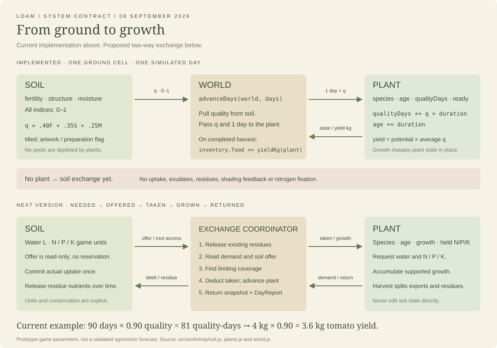

> Historical working brief. See ../SOIL.md, ../SOIL-PLANT.md and ../PLANT.md for authoritative requirements.

# LOAM — Soil and plant module

**Implementation brief · revised 8 September 2026**

Build a small, explainable exchange: **what the plant needed, what the soil
supplied, how much the plant grew, and what returned to the ground.**

This document is the handoff for implementing that exchange in the existing
LOAM workshop. It specifies a proposed next version; it does not claim those
changes have already shipped. `[current]` describes verified code. `[next]`
defines the recommended implementation. All numeric crop budgets in this
brief are game settings until calibrated against evidence.

## 1. The design in one page

**Soil owns supplies. Plants own requirements and growth. The game coordinates
their exchange. The interface explains the result.**

Keep one soil record and at most one plant per 1 m² ground cell. Beds select
cells; moving or removing a boundary never creates fresh soil. No module
needs to know about character art, markets, health, stories, or browser storage.

| Keep in the next module | Leave for later |
|---|---|
| Finite available water and separate N/P/K budgets | Soil chemistry, pH availability curves, salinity |
| Species-specific demand across three growth phases | Photosynthesis pathways, thermal-time phenology |
| Daily growth limited by supplies and root access | Disease, pests, mortality, crop competition |
| Nutrients retained in plants and returned through residues | Microbial populations, mycorrhiza, root exudate effects |
| A recorded explanation of each daily result | Weather generation, erosion, multiple soil layers |
| Save/load, harvest records, and an existing-game adapter | Human nutrition, market pricing, story consequences |

This is intentionally a resource-budget game model. It should teach that
soil has different constraints and that harvest exports resources. It does
not attempt to predict a real tomato's exact nutrient requirements.



## 2. What exists today [current]

| Source | Current responsibility |
|---|---|
| [`soil.js`](../../src/workshop/soil.js) | `fertility`, `structure`, `moisture` indices (0–1), `tilled` flag; treatments and `quality()` |
| [`plants.js`](../../src/workshop/plants.js) | Species settings; `seed()`, `grow()`, `yieldKg()` |
| [`world.js`](../../src/workshop/world.js) | Calls both modules; owns ground, tasks, calendar and inventory |
| [`loam.js`](../../src/scenes/loam.js) | Controls, journal, rendering lifecycle and local saves |

The current exchange is exactly:

```js
// Within advanceDays(), for each planted cell, once per simulated day:
const q = quality(c.soil);         // 0.4 fertility + 0.35 structure + 0.25 moisture
grow(c.plant, 1, q);               // mutates the plant, returns no payload
// At completion of a ready plant's harvest task:
w.inventory.food += yieldKg(c.plant);
c.plant = null;
```

`grow()` accumulates `qualityDays += duration * q`, increments `age`, and sets
`ready` at the species' configured duration. Yield is `potentialKg *
qualityDays / age` (zero at age zero). Before maturity this is a projection,
not edible biomass. At maturity, further days cannot change it.

| Species | Days | Potential kg/plant | Minimum quality to plant |
|---|---:|---:|---:|
| Tomato | 90 | 4 | 0.70 |
| Bean | 65 | 0.8 | 0.60 |
| Radish | 30 | 0.15 | 0.55 |

These parameters are illustrative. Plants currently return **nothing** to
soil. Watering sets the moisture index to 1 for 2 L; compost adds 0.25 fertility;
tilling adds 0.30 structure. Growth does not deplete anything. The separate
[`src/soil/nutrients.js`](../../src/soil/nutrients.js) educational model is not
connected to this loop.

The [earlier contract and research roadmap](../SOIL-PLANT-REFERENCE-v1.md) retain
the full current field tables and longer-term scientific proposals. Where
they differ, this brief governs the recommended next implementation.

## 3. State and units [next]

Use plain serializable records. Public functions reject nonfinite values,
negative resource quantities, unknown species, and invalid phase definitions.
Do not silently convert physical units to game points.

| Record | Required fields | Ownership / interpretation |
|---|---|---|
| `SoilState` | `waterL`, `capacityL`, `available:{n,p,k}`, `structure` | Soil: accessible water in litres, nutrient **game units** in three separate pools, structure 0–1 |
| `Residue` | `id`, `nutrients:{n,p,k}`, `releaseFractionPerDay` | Soil: nutrients awaiting release; never count these as available yet |
| `PlantState` | `id`, `speciesId`, `ageDays`, `growthPoints`, `held:{n,p,k}`, `status` | Plant: status is `growing` or `ready`; nutrient units acquired so far |
| `SpeciesDefinition` | `id`, `maturityDays`, `potentialYieldKg`, `phases`, `harvestExportFraction:{n,p,k}`, `residueReleaseFractionPerDay` | Data configuration, not UI code |
| `PhaseDefinition` | `endDay`, `dailyDemand:{waterL,n,p,k}` | Three phases: establishment, leafy growth, harvest formation; exclusive end day |
| `DayReport` | `cellId`, `day`, `needed`, `offered`, `taken`, `coverage`, `rootAccess`, `growthFraction`, `limitingFactors`, `released`, `waterLossL` | Read-only explanation for UI, tests and other systems |
| `HarvestRecord` | `id`, `plantId`, `speciesId`, `day`, `freshKg`, `exported:{n,p,k}` | Host inventory; nutrient game units are not human dietary nutrient values |

Water storage represents the **plant-accessible bucket**, not total soil water.
One litre applied to a 1 m² cell corresponds to 1 mm depth, but this version
does not compute field capacity or wilting point. Nutrient units cannot be
interpreted as ppm, grams or fertilizer recommendations. Fresh harvest kg
are a configured game yield, not a conserved biomass calculation.

Retire `fertility` as a spendable resource; expose N/P/K instead. Derive a
moisture display from `waterL / capacityL`. Keep structure as a stable access
condition affected by work, not something a plant consumes. Keep `examined`
and `tilled` as existing cell/UI metadata.

## 4. Public interface [next]

These are proposed exports, not existing functions. Keep the current module
locations and add a small coordinator. All new functions return new records;
they do not modify their arguments or use a global clock.

```ts
// soil.js — unaware of species, plants or beds
offerResources(soil: SoilState): ResourceOffer
applySoilExchange(soil: SoilState, taken: Resources): SoilState
releaseResidues(soil: SoilState): { soil: SoilState, released: NPK }
applyTreatment(soil: SoilState, treatment: Treatment): TreatmentResult

// plants.js — unaware of soil internals or terrain
requestResources(plant: PlantState, species: SpeciesDefinition): Resources
advancePlant(plant: PlantState, species: SpeciesDefinition,
             taken: Resources, growthFraction: number): PlantState
finishHarvest(plant: PlantState, species: SpeciesDefinition): HarvestResult

// exchange.js — one deterministic transaction; no DOM, timers or storage
stepCellDay(cell: CellState, species: SpeciesDefinition | null,
            day: number): { cell: CellState, report: DayReport }
```

`Resources` has `{waterL,n,p,k}`; `NPK` has `{n,p,k}`. `ResourceOffer` contains
those available quantities plus `rootAccess`. `Treatment` is a tagged water,
compost or till operation with quantities. `TreatmentResult` contains the
new soil, accepted quantities and overflow/loss quantities. `HarvestResult`
contains fresh kg, exported N/P/K and one residue record; the host supplies
stable record IDs and clears the plant only when it commits the harvest.

`offerResources()` is a read-only quote. **It neither reserves nor withdraws
resources.** `applySoilExchange()` deducts actual `taken` once. There is no
reservation protocol or second settlement pass in this version.

## 5. A daily transaction, completely specified [next]

Run fixed one-day steps in cell-ID order. Animation frames never advance crop
time. The host commits each `(cellId, day)` only once and records the completed
day in its save. Recomputing from the same input is safe; applying a day twice
is not. Build the next world snapshot before replacing the old one.

1. Release nutrients from existing residues: for each element,
   `released = remaining * releaseFractionPerDay`; subtract from residue and
   add to available soil. Newly harvested residues start releasing on the
   following simulated day. Empty cells also run this step.
2. If no growing plant exists, report no demand or uptake and finish. A ready
   plant no longer grows or consumes resources in this first model.
3. Determine phase from `ageDays`: select the first phase with
   `ageDays < endDay`. Read its daily demand and soil's available offer.
4. Calculate coverage for each resource: `demand === 0 ? 1 :
   min(1, available / demand)`. Set `rootAccess = clamp(structure)`.
5. Set `growthFraction = min(rootAccess, waterCoverage, nCoverage,
   pCoverage, kCoverage)`. Record all tied limiting factors (within 1e-9);
   if all equal 1, record an empty list meaning “needs met.”
6. Set `taken[resource] = demand[resource] * growthFraction`. Deduct only these
   quantities from soil. Add taken N/P/K to `plant.held`; record taken water
   as a plant-use loss from the soil bucket, not stored nutrients.
7. Add `growthFraction` to `growthPoints`, add 1 to `ageDays`, and mark ready
   at `maturityDays`. Return the new cell plus its complete report.

Scaling all uptake with growth is an intentional simplification: this version
has no maintenance water demand, luxury nutrient uptake, or nutrient storage
that can compensate for a later shortage. It can therefore show a fully
stalled plant taking no water. Do not present it as complete plant physiology.

```mermaid
sequenceDiagram
    participant G as Existing game
    participant X as Daily exchange
    participant S as Soil module
    participant P as Plant module
    G->>X: stepCellDay(cell, species, day)
    X->>S: releaseResidues(soil)
    S-->>X: new soil + released N/P/K
    X->>P: requestResources(plant, species)
    P-->>X: daily water / N / P / K demand
    X->>S: offerResources(soil)
    S-->>X: available quantities + root access
    Note over X: Calculate coverage, growth fraction and actual taken
    X->>S: applySoilExchange(soil, taken)
    S-->>X: new soil (one debit)
    X->>P: advancePlant(plant, species, taken, growthFraction)
    P-->>X: new plant
    X-->>G: new cell + DayReport
    Note over G: Commit once; journal reads the same report
```

## 6. Yield, harvest and return [next]

```text
realizedYieldFraction = growthPoints / maturityDays
harvestFreshKg = potentialYieldKg * realizedYieldFraction
exported[element] = plant.held[element] * harvestExportFraction[element]
residue[element] = plant.held[element] - exported[element]
```

Only ready plants may be harvested. Commit harvested food, exported nutrient
units, returned residue and plant removal together. Harvest does **not** charge
the soil again. Returning residues eventually replenishes only their held
nutrients; it never refunds the exported portion or the consumed water.

This preserves the user's useful rule: **90% growing conditions across the
entire life produce 90% of configured yield.** The percentage now means the
average daily *growth fraction*, not the old weighted soil score. Name it
“growth supported” in the UI so the changed meaning is explicit.

Example: a 90-day, 4 kg tomato at 0.9 growth every day produces 81 growth
points and a 3.6 kg harvest. A one-day example with water demand 4 L and N
demand 2 units, but only 1 N unit available (all other coverage at 1), grows
at 0.5 and takes **2 L water and 1 N unit**. Unused offered water stays in soil.

Seed nutrients, fixation and living-root carbon are deferred. Bean does not
automatically create soil nitrogen. Add those later as explicit external
inputs and transfers. The return loop ships first through crop residues.

## 7. Configuring species without rewriting the engine [next]

Keep tomato/bean/radish IDs and current maturity/yield settings for continuity.
Add three phase definitions per species, each with daily water and N/P/K
demand. Phase end days must increase strictly and end at maturity. Validate
all rates and export/release fractions before loading the scenario.

Ship a separate, explicitly named `demo` parameter set. To make that set
implementable without pretending to have field evidence, begin with equal
thirds (`ceil(days/3)`, `ceil(2*days/3)`, `days`) and these provisional rates:

| Crop | Base daily demand: water L / N / P / K units |
|---|---|
| Tomato | 2 / 1 / 0.3 / 1.3 |
| Bean | 1 / 0.6 / 0.2 / 0.6 |
| Radish | 0.3 / 0.2 / 0.1 / 0.2 |

Multiply all four base demands by 0.5 / 1 / 1.5 in the three phases.
Initially export 0.5 of each held nutrient at harvest; return the remainder
as residue releasing 0.1 of its remaining nutrients per day. These are
**balance-test settings**, not measured uptake or decomposition rates. Replace
them through configuration as evidence improves; keep their provenance.

Every configurable quantity should record value, unit, source (or `demo`),
and assumptions. Changing demands must not require renderer changes.

## 8. What the player sees [next]

The journal is an explanation of the simulation result, not a second model.

| UI item | Data source / behavior |
|---|---|
| “Needed / supplied” rows | `DayReport.needed` and `taken`, with units |
| “Growth supported today: 50%” | `growthFraction`; never recompute in the UI |
| “Nitrogen was limiting” | `limitingFactors`; show ties rather than inventing one winner |
| Water and N/P/K remaining | Soil pools after the transaction |
| “Returning to soil” | Residue nutrient quantities and today's `released` |
| Harvest progress | Age and growth points; mature yield is separately identified |

For a bed, sum quantities and average growth fractions across its growing
plants. Keep the per-cell breakdown available: a bed average must not hide
which patch is struggling. Unknown soil remains unknown until examined; do
not leak unobserved pools through the ordinary journal. A developer inspection
mode may show the full report. Attach historical reports to their cell/day;
changing a boundary changes the selected history, not the underlying records.

Keep “Prepare & tend,” click-to-work, interruption and cell completion intact.
Water work transfers its configured litres into the bucket; overflow is
recorded. Compost adds a configured N/P/K vector to residues rather than
instantly restoring fertility. Till affects structure only. Set these amounts
in scenario data. Preparation recommends actions from shortages; it is not
a requirement to till every bed.

For the demo, use `capacityL=10` per cell, water work adds 2 L, one compost
scoop adds `{n:5,p:2,k:5}` to residues at the same 0.1/day release rate, and
till retains the existing +0.30 clamped structure change. No passive water
loss, drainage or rainfall in this version. Report irrigation overflow
separately from plant water use.

A new demo starts each cell with 6 L water, `{n:30,p:10,k:30}` available units,
no residues, and the existing coordinate-derived structure. This is a new
scenario, not a conversion of legacy scores. Permit planting on any examined,
empty cell; replace the old `minQuality` prohibition with warnings from the
current offer. Poor ground is something the player can investigate, not an
invisible lock. A new plant begins at age/growth zero with zero held nutrients.

## 9. Integration handoff: implement this in the existing game [next]

1. **Keep `/loam` and its existing interactions.** Add `exchange.js` and a
   versioned demo species/scenario definition; extend soil/plants modules.
   Do not rewrite navigation, movement, bed geometry or the renderer.
2. **Wire the host.** Replace the `grow(...quality(...))` path in
   `world.advanceDays()` with the transaction above. Run empty cells for residue
   release. Preserve fixed daily steps and blocked advancement during work.
3. **Wire work completion.** Apply treatments only when a work cell finishes.
   Deduct player inventory exactly once. Store each plant's nutrient holdings;
   harvest atomically into crop-specific records plus residues. Keep the old
   food-kg total as a derived compatibility view, not a second ledger.
4. **Wire presentation.** Expose `DayReport` to the journal; art continues to
   read species, stage and progress through a small view adapter. World events
   may announce work/harvest completion; soil and plants import no story code.
5. **Version saves.** Save `schemaVersion`, `modelVersion`, parameter-set
   version and last completed day. Keep a separate legacy v1 loader/model for
   existing saves. Do not infer real nutrient stocks from old fertility scores.
   Offer a new resource-model workshop without deleting the old save. Do not
   mix v1 and v2 cells within one simulation.
6. **Bound history.** Retain the last 120 daily reports per cell plus cumulative
   growth, resource and harvest totals. Other systems receive stable event IDs
   (`worldId:cellId:day:type`) and deduplicate their own effects.
7. **Demonstrate the loop.** Draw → examine → prepare → plant → consume supplies
   → diagnose shortage → replenish → harvest → return residue → plant again.

No new networking, dependency, UI framework, or Rust/WASM bridge is required.
Integration should be an adapter change in `world.js`, not a rewrite of the
surrounding game. The word “ideal” means an explicit fixture with sufficient
daily supply, structure 1, and known species settings—not infinite nutrients
quietly inserted into ordinary play.

## 10. Acceptance checks [next]

- **Ideal:** structure 1 and sufficient supply every day produce exactly the
  configured potential yield at maturity.
- **90%:** constant 0.9 growth produces exactly 0.9 potential; mixed conditions
  match the accumulated daily fractions.
- **Limited supply:** no pool goes negative; `taken <= needed` and `taken <=
  offered`; zero-demand resources do not limit growth.
- **Explainability:** reports agree with state changes and include tied limits.
- **N/P/K conservation, each separately:** available soil + residue + plant-held
  + cumulative exported equals initial total + external additions. Harvest
  transfers holdings; it does not withdraw twice. Removing a bed changes none.
- **Water:** ending storage = starting storage + additions − overflow − plant
  use, within numerical tolerance. Water use is an explicit output, not a
  plant nutrient stock.
- **Return:** residue nutrients release gradually; released + remaining equals
  the original residue; harvesting twice cannot duplicate food or residues.
- **Time:** seven daily calls match one seven-day host advance; paused rendering
  never ages plants; a ready plant remains unchanged except at harvest.
- **Persistence:** save/load mid-work and mid-growth reproduces uninterrupted
  results; unsupported parameter versions fail visibly, without erasing saves.
- **Compatibility:** current routes, bed drawing, cancellation, supply charging
  and ground history still work. Rendering reads reports; no UI-derived yields.

Keep legacy tests on the legacy path. Add resource-model fixtures rather than
changing their expected results to disguise a changed model.

These prove consistency and educational legibility, not field accuracy.
Reference-yield calibration is a separate research milestone.

## 11. What Vanaspati contributes

Reviewed source at commit
[`91fd148`](https://github.com/MacCracken/vanaspati/tree/91fd1480b586acf6ec6ac873ad8875f4456afd03).
This was a source review, not an execution or validation of its models.

| Observed pattern | LOAM adaptation |
|---|---|
| [`water.rs`](https://github.com/MacCracken/vanaspati/blob/91fd1480b586acf6ec6ac873ad8875f4456afd03/src/water.rs): storage, bounded removals, `WaterFluxes` | Separate quantities held from quantities moved; return a daily explanation |
| [`nitrogen.rs`](https://github.com/MacCracken/vanaspati/blob/91fd1480b586acf6ec6ac873ad8875f4456afd03/src/nitrogen.rs): available/organic pools and uptake | Distinguish immediately available resources from resources awaiting release |
| [`decomposition.rs`](https://github.com/MacCracken/vanaspati/blob/91fd1480b586acf6ec6ac873ad8875f4456afd03/src/decomposition.rs): litter decay and nutrient release | Use a small delayed residue return instead of an instant soil reset |
| [`integration/soorat.rs`](https://github.com/MacCracken/vanaspati/blob/91fd1480b586acf6ec6ac873ad8875f4456afd03/src/integration/soorat.rs): growth/root presentation records | Keep renderable values outside physiology; it has adapters, not LOAM's playable UI |
| [`architecture overview`](https://github.com/MacCracken/vanaspati/blob/91fd1480b586acf6ec6ac873ad8875f4456afd03/docs/architecture/overview.md): consumer-driven calculation library | Let the game own time and coordination; avoid a second runtime |

Do not import its entire physiological scope or assume presets are validated
homestead yields. Its Rust records can be mutated by callers; “no internal
runtime” does not mean it has no state records. LOAM's proposed new transaction
returns a replacement snapshot as a deliberate local design choice.

The repository declares GPL-3.0 in its
[license](https://github.com/MacCracken/vanaspati/blob/91fd1480b586acf6ec6ac873ad8875f4456afd03/LICENSE).
No source code or assets were copied into LOAM. This document references
architectural ideas; adding the library itself would be a separate dependency
decision.

## 12. Research parking lot

Retain NASA's production-scheduling approach and the prior document's soil
science references for later calibration. Detailed pH chemistry, nutrient
concentrations, carbon budgets, fixation and thermal time can replace internals
when they serve a player question. They are not prerequisites for this module.

**The stable promise is the exchange and its explanation. The equations can
improve behind that boundary.**
